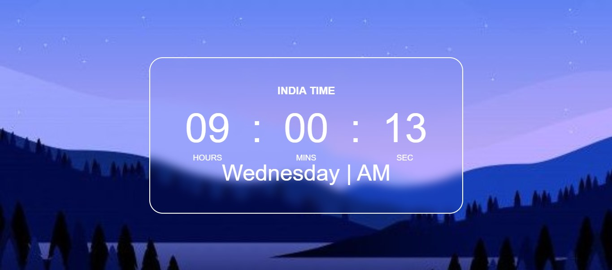
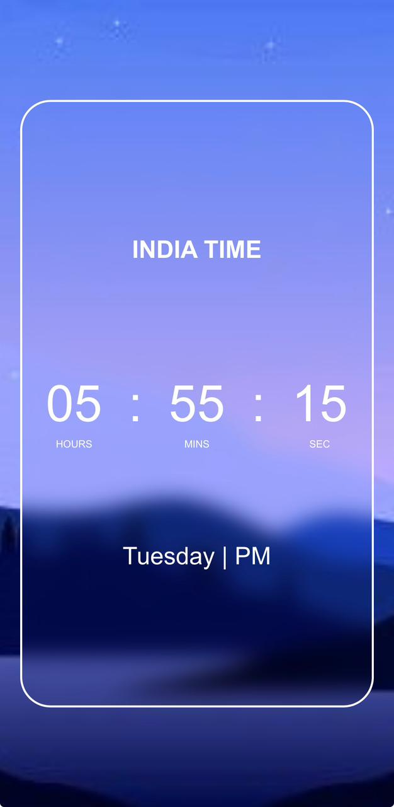

# Digital-clock
A responsive digital clock built using HTML, CSS, and JavaScript that displays real-time updates every second.
🕒 Digital Clock

 A simple and responsive <b>Digital Clock</b> built using HTML, CSS, and JavaScript. 
 
      

🚀 Live Demo
https://digital-clock-by-monu.netlify.app/

📌 Features

✨ Real-time clock updating every second
📱 Fully responsive design
🎨 Modern and clean UI
⚡ Lightweight and fast
🌙 Easy customization

🛠️ Tech Stack

🧱 HTML5 – Structure

🎨 CSS3 – Styling & Layout

⚡ JavaScript (ES6) – Time functionality

📂 Project Structure
Digital-Clock/
│── index.html
│── style.css
│── script.js
└── README.md
⚙️ How It Works

Uses JavaScript Date() object to fetch current time

Updates every second using setInterval()

Dynamically injects time into the DOM

Styled using modern CSS

📸 Screenshot

  

This is mobile ratio Screenshot

  

